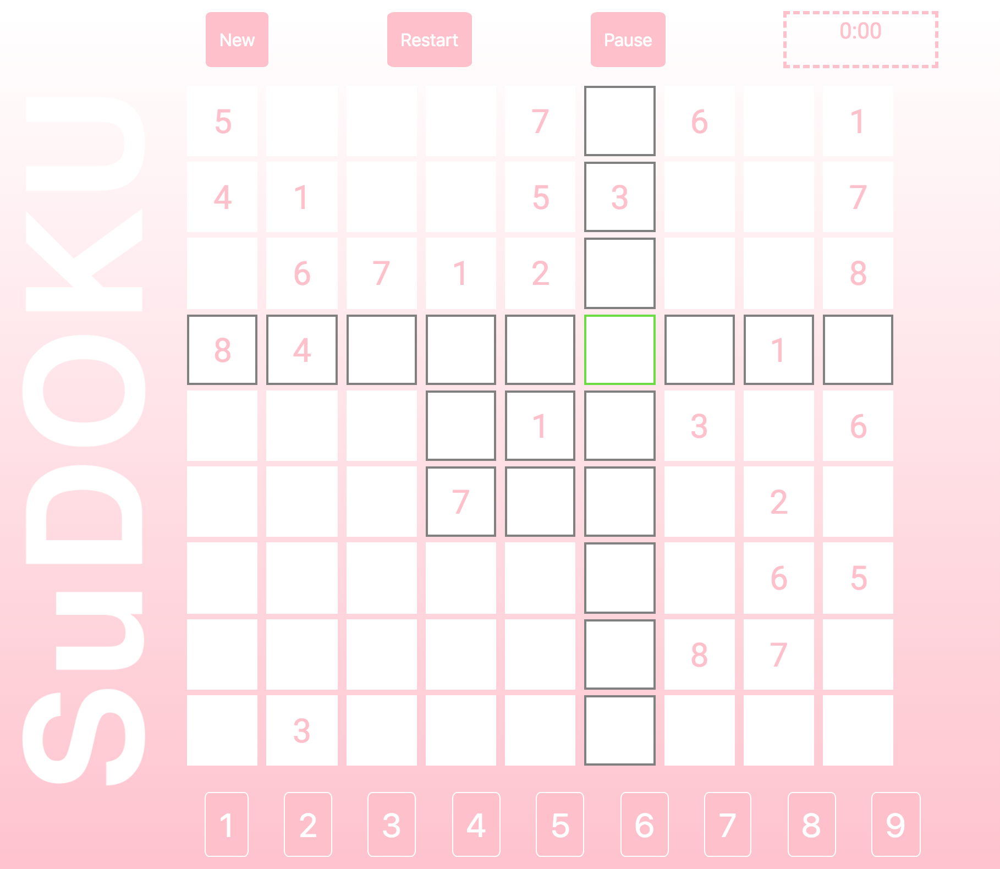

# SuDOKU

## LINKS
[Deployed site](http://easterjd.surge.sh/)

[Frontend repo](https://github.com/easterjd/q1Project-suDoku)

## ABOUT
I've always loved puzzle-type games and SuDoku is no different. SuDoku is something that's very special to me as it's been an amazing tool not only to relax when I'm stressed out out also challenge me when I'm bored.

I wanted to create a new SuDoku game because--since it has filled up such a great space in my life--I wanted to create a game platform that reflected a little bit about who I am as well.

## USER STORIES
As a user, I can...
### Done
-See a puzzle timer.
-Pause, reset, & start a new game.
-See relevant squares with respected to the selected squares.
-See when a move is incorrect immediately.

### In Progress
-Erasing squares.
-Locking ability to overwrite template puzzle numbers.

## Next Steps
-Hints.
-Notes to plan out possibilities.
-Scoreboard with time scores and mistake count.

## Built With
-HTML5, CSS3.
-JavaScript.
-Bootstrap.
-Browserify.

## INSTALLATION
To run this locally:
1. Clone/download the project: (https://github.com/easterjd/q1Project-suDoku) and
2. Install packages with command `npm install`
3. Start the project with command `npm run dev`
